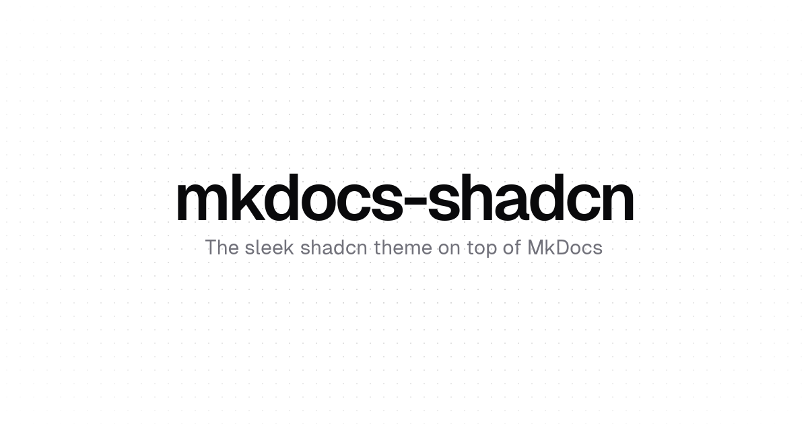
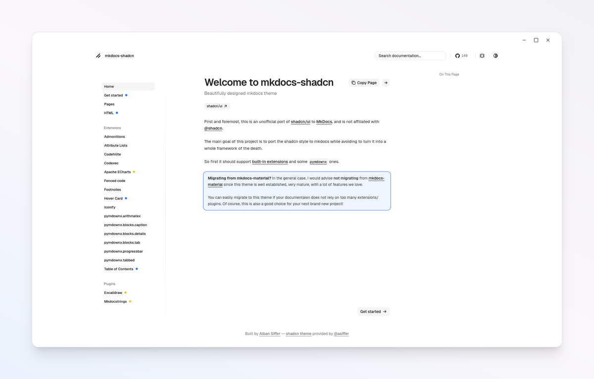

<p align="center">
  <a href="https://github.com/fastxteam/mkdocs-shadcn-lwq/actions/workflows/testing.yaml"></a>
  <a href="https://pypistats.org/packages/mkdocs-shadcn-lwq"></a>
  <a href="https://pypi.org/project/mkdocs-shadcn-lwq"></a>
</p>





> [!IMPORTANT]  
> This is an unofficial port of shadcn/ui to MkDocs, and is not affiliated with [@shadcn](https://twitter.com/shadcn).


## Documentation

Yes, yes, the [documentation](https://fastxteam.github.io/mkdocs-shadcn-lwq/) is built with this theme.

## Quick start

`mkdocs-shadcn-lwq` can be installed with `pip`

```shell
pip install mkdocs-shadcn-lwq
```

Add the following line to `mkdocs.yml`:

```yaml
theme:
  name: shadcn-lwq
```

## Extensions

The theme tries to support the built-in extensions along with some `pymdownx` ones. 

- [x] [`admonition`](https://python-markdown.github.io/extensions/admonition/)
- [x] [`codehilite`](https://python-markdown.github.io/extensions/code_hilite/)
- [x] [`fenced_code`](https://python-markdown.github.io/extensions/fenced_code_blocks/)
- [x] [`footnotes`](https://python-markdown.github.io/extensions/footnotes/)
- [x] [`pymdownx.tabbed`](https://facelessuser.github.io/pymdown-extensions/extensions/tabbed/)
- [x] [`pymdownx.blocks.details`](https://facelessuser.github.io/pymdown-extensions/extensions/blocks/plugins/details/) 
- [x] [`pymdownx.blocks.tab`](https://facelessuser.github.io/pymdown-extensions/extensions/blocks/plugins/tab/) 
- [x] [`pymdownx.progressbar`](https://facelessuser.github.io/pymdown-extensions/extensions/progressbar/)
- [x] [`pymdownx.arithmatex`](https://facelessuser.github.io/pymdown-extensions/extensions/arithmatex/)
- [x] builtin [`shadcn.echarts`](https://fastxteam.github.io/mkdocs-shadcn-lwq/extensions/echarts/)
- [x] builtin [`shadcn.iconify`](https://fastxteam.github.io/mkdocs-shadcn-lwq/extensions/iconify/)
- [x] builtin [`shadcn.codexec`](https://fastxteam.github.io/mkdocs-shadcn-lwq/extensions/codexec/) 


## Plugins

- [x] builtin [`excalidraw`](https://excalidraw.com/) - With this plugin, you can directly edit your excalidraw scene in dev mode (kind of WYSIWYG) while it is rendered as svg at build time.
- [x] [`mkdocstrings`](https://mkdocstrings.github.io/) - a MkDocs plugin for auto-generating API documentation from docstrings. (alpha)

## Developers

This project is open to contributions. In general, we need to apply the shadcn/ui style to already existing plugins or extensions. 

We recently release the css sources we use to style the theme. It mainly uses [`tailwindcss`](https://tailwindcss.com/).

### Setup

First clone the repo:
```shell
git clone https://github.com/fastxteam/mkdocs-shadcn-lwq
cd mkdocs-shadcn-lwq
```

Then you can install python dependencies ([`uv`](https://docs.astral.sh/uv/) required):
```shell
uv sync --all-extras
```

Finally, you can install tailwind with your favourite package manager (npm, yarn, bun, etc.):

```shell
bun install
```

### Dev mode

We use the project pages to as a test project for this theme. You can run the local server in the `pages/` subdirectory.

```shell
cd pages/
uv run mkdocs serve --watch-theme -w ..
```

In parallel, you are likely to run the tailwind watcher to compile the css sources. In the root folder:

```shell
bun dev
```

### Testing

Tests are managed by [`pytest`](https://docs.pytest.org/en/stable/) and are located in the [tests/](./tests/) folder.

Currently we only test that there is no browser issue through [playwright](https://playwright.dev/).
